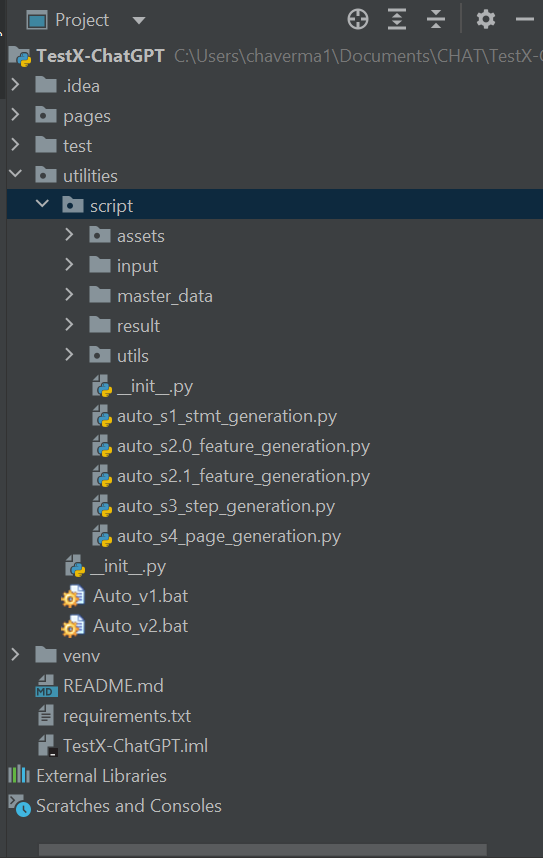
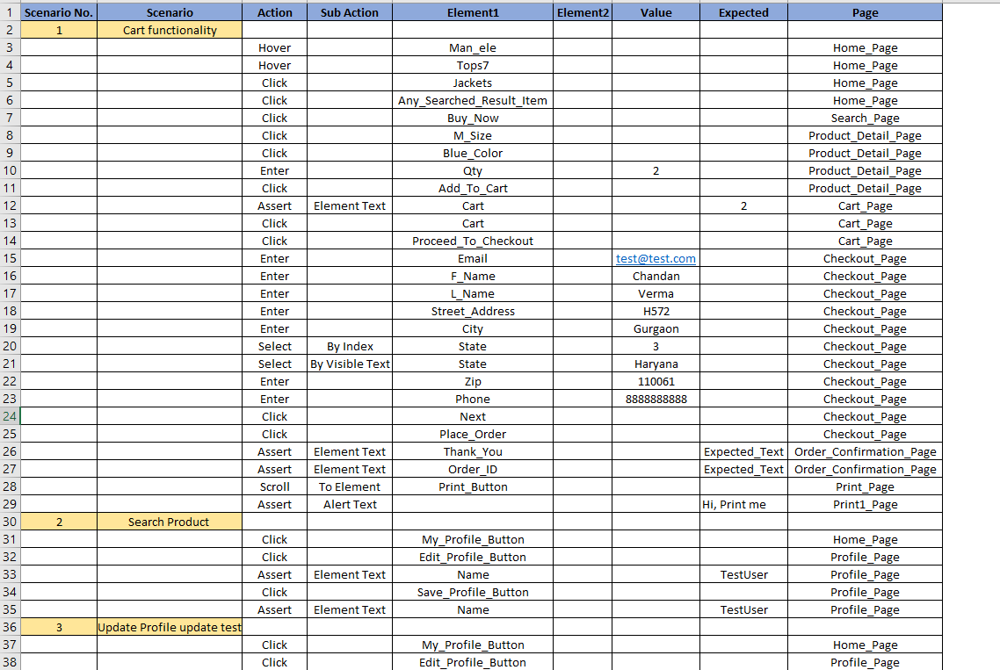
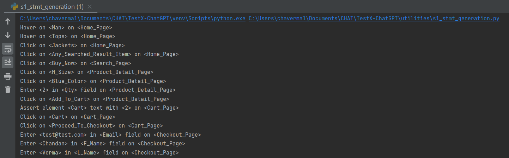
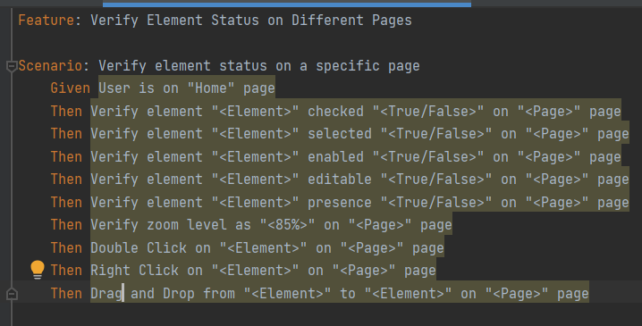
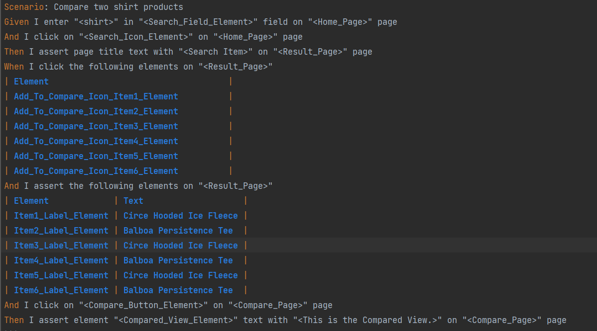
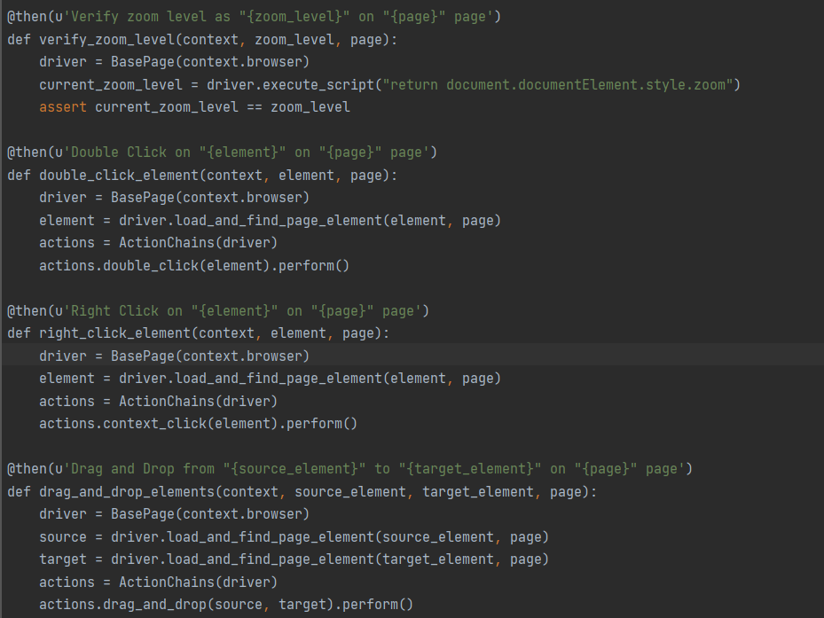
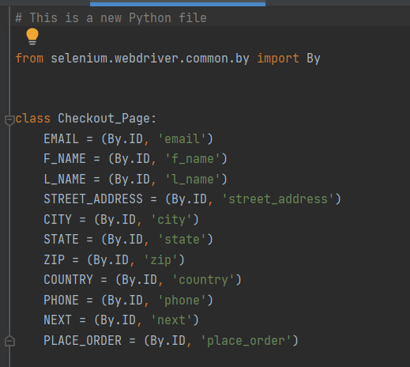

<!-- TABLE OF CONTENTS -->

  
Table of Contents

  <ol>
    <li>
      <a href="#ABOUT THE PROJECT">TestX-ChatGPT</a>
      <ul>
        <li><a href="accelerator-features">Accelerator features</a></li>
      </ul>
    </li>
    <li>
      <a href="built-with">Built with</a>
    </li>
  <li>
      <a href="structure">Project Structure</a>
    </li>
    <li>
      <a href="#getting-started">Getting Started</a>
      	<ul>
        		<li><a href="prerequisites">Prerequisites</a></li> 
        </ul>
    </li>
    <li>
    <a href="usage">Steps to Use</a>
        <ul>
            <li><a href="Write-test-steps-in-Excel"> Write test steps in Excel</a></li>
            <li><a href="Execute-auto_s1_stmt_generation.py-script"> Execute auto_s1_stmt_generation.py script</a></li>
            <li><a href="Execute-auto_s2.0_feature_generation.py-script"> Execute auto_s2.0_feature_generation.py script</a></li>
            <li><a href="Execute-auto_s2.1_feature_generation.py-script"> Execute auto_s2.1_feature_generation.py script</a></li>
             <li><a href="Execute-auto_s3_step_generation.py-script"> Execute auto_s3_step_generation.py script</a></li>           
             <li><a href="Execute-auto_s4_page_generation.py-script"> Execute auto_s4_page_generation.py script</a></li>
            </li>
        </ul>
    </li>
    <li><a href="#faq">FAQs</a></li>
    <li><a href="#contributing">Contributing</a></li>
    <li><a href="#contact">Contact</a></li>
  </ol>

<!-- ABOUT THE PROJECT -->
### **1. TestX-ChatGPT**
TestX-ChatGPT is a Python utility that integrates ChatGPT functionality to automatically generate Behavior Driven Development (BDD) feature files, step definitions, and page classes with locators, as per the input provided by user.

#### 1.1 Accelerator Feature ####
In this accelerator we have following 5 python scripts on `TestX-ChatGPT\utilities\script` location. 
1. `auto_s1_stmt_generation.py` : This script is responsible to generate the plain english statements.
2. `auto_s2.0_feature_generation.py` : This script is responsible to generate the BDD feature file.
3. `auto_s2.1_feature_generation.py` : This script is responsible to generate the advance BDD feature file with other cucumber features.
4. `auto_s3_step_generation.py` : This script is responsible to generate the step definition file.
5. `auto_s4_page_generation.py` : This script is responsible to generate the page classes with locator declaration.

By using above scripts we can get following automatic generated :
1. Feature Files - Will be able to generate BDD feature on `TestX-ChatGPT\utilities\script\result\feature` location. 
2. Step Definitions - Will be able to generate Step definition file on `TestX-ChatGPT\utilities\script\result\step` location
3. Page Classes + Locators - Will be able to generate page classes with locators on `TestX-ChatGPT\utilities\script\result\pages`  

Additionally, it can be customized to cater to various user requirements.

### **2. Built with**
* **Python** - is a programming language [https://www.python.org/](https://www.python.org/)
* **Openai** - is a library provides convenient access to the OpenAI REST API [https://openai.com/](https://openai.com/)
* **Langchain** - is a framework designed to simplify the creation of app using llm [https://github.com/langchain-ai/langchain](https://github.com/langchain-ai/langchain)
* **Pandas** - is a Python package [https://pypi.org/project/pandas/](https://pypi.org/project/pandas/)
### **3. Project Structure**

### **4. Getting Started**

Follow these instructions to get TestX-ChatGPT accelerator up and running and ready to use on your local machine.

#### **4.1 Prerequisites**

- Latest updated Python should up and working
- Install following python packages
  - pip install langchain
  - pip install openai
  - pip install unstructured
  - pip install chromadb
  - pip install tiktoken
  - pip install langchain-openai
  - pip install pandas
  - pip install openpyxl
  - pip install pyarrow
  - pip install networkx
  - pip install langchain-community
  - others as well, refer requirement.txt file for more info.
- Sign up on https://chat.openai.com/auth/login
- Generate api key to use in python script
- Please in `token` .json file, located at `utilities/script/input/`.
- `Now that it's all done, go ahead and make use of your saved time.`

<!-- USAGE EXAMPLES -->
### **5. Steps to Use**

To utilize this accelerator, the user needs to perform the following steps:

#### **5.1 Write test steps in Excel**
* Write test steps (multiple scenarios as well) in `test_guidelines.xlsx` Excel placed in project location `TestX-ChatGPT\utilities\script\input`(Refer below sample steps)
* Make sure Sheet1 should be primary.

#### **5.2 Execute auto_s1_stmt_generation.py script**
* Execute `auto_s1_stmt_generation.py` python script to generate the plain english statement. Output of this script we have to copy from console and place inside input.txt file on location `TestX-ChatGPT\utilities\script\input\input.txt` so that next script can use this information as an input. 

#### **5.3 Execute auto_s2.0_feature_generation.py script**
* Execute `auto_s2.0_feature_generation.py` python script, this script will take plain english statement as an input (Generated in step 4.1) to generate the BDD feature file on `TestX-ChatGPT\utilities\script\result\feature` location.

#### **5.4 Execute auto_s2.1_feature_generation.py script**
* Execute `auto_s2.1_feature_generation.py` python script, to generate the BDD feature file on `TestX-ChatGPT\utilities\script\result\feature` location with advance BDD features.

#### **5.5 Execute auto_s3_step_generation.py script**
* Execute `auto_s3_step_generation.py` python script, this script will generate step definition file on `TestX-ChatGPT\utilities\script\result\step` location.

#### **5.6 Execute auto_s4_page_generation.py script**
* Execute `auto_s4_page_generation.py` python script to generate the page classes with locators on `TestX-ChatGPT\utilities\script\result\pages` location.

### **Note -** We can use `Auto_v1.bat` or `Auto_v2.bat` files to execute all scripts in one go.

### **6. FAQs**
NA
<!-- CONTRIBUTING -->
### **7. Contributing**

Contributions are what make the open source community such an amazing place to be learned, inspire, and create. Any contributions you make are **greatly appreciated**.

1. Fork the Project
2. Create your Feature Branch (git checkout -b feature/AmazingFeature)
3. Commit your Changes (git commit -m 'Add some AmazingFeature')
4. ush to the Branch (git push origin feature/AmazingFeature)
5. Open a Pull Request

----
### 8. Contact
- [Mayank Panwar](mailto:mayank.panwar@publicissapient.com)
- [Chandan Verma](mailto:chandan.verma@publicissapient.com)
- [Aanchal Chaudhary](mailto:aanchal.chaudhary@publicissapient.com)

